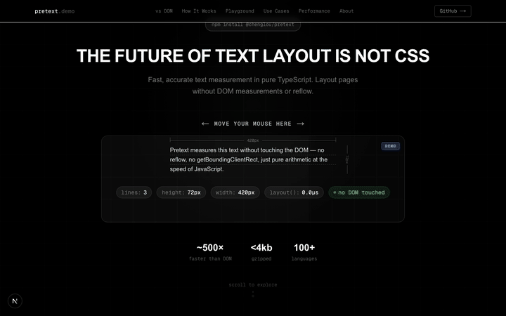
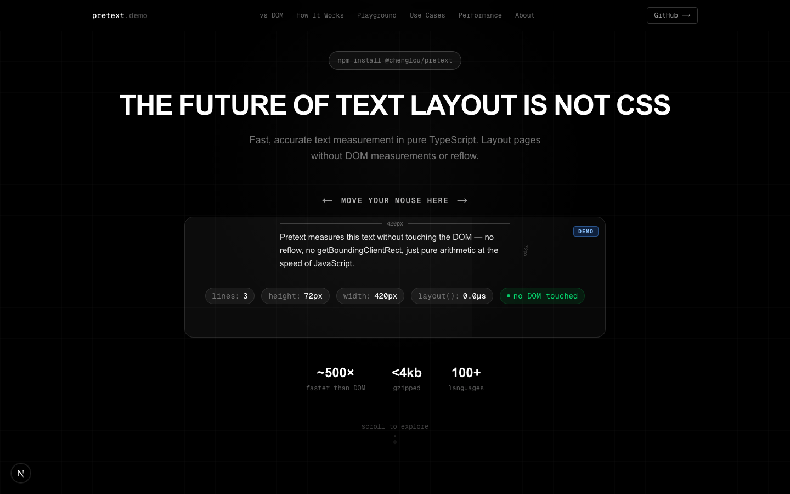
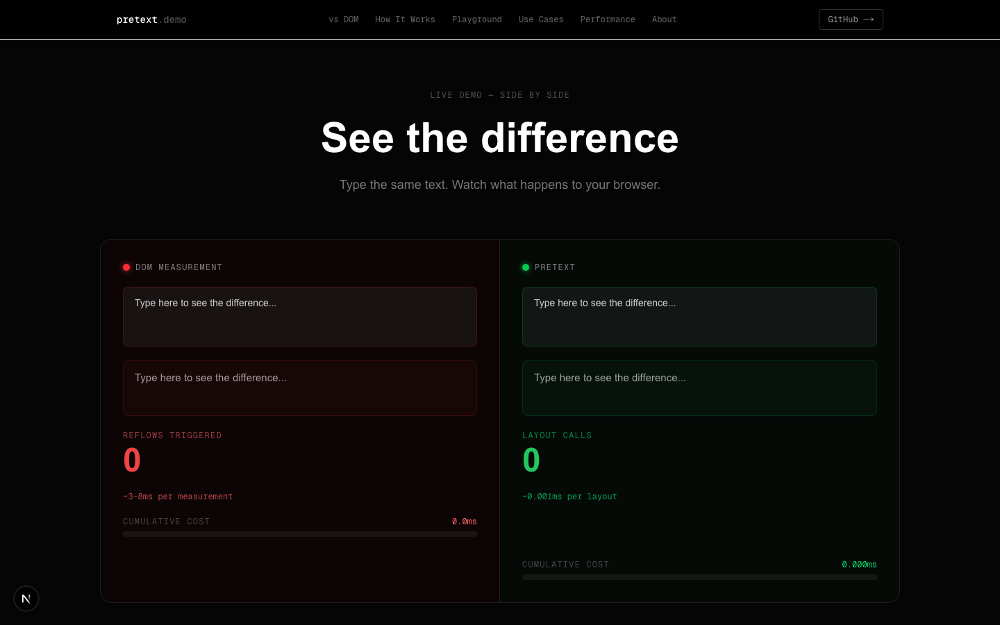
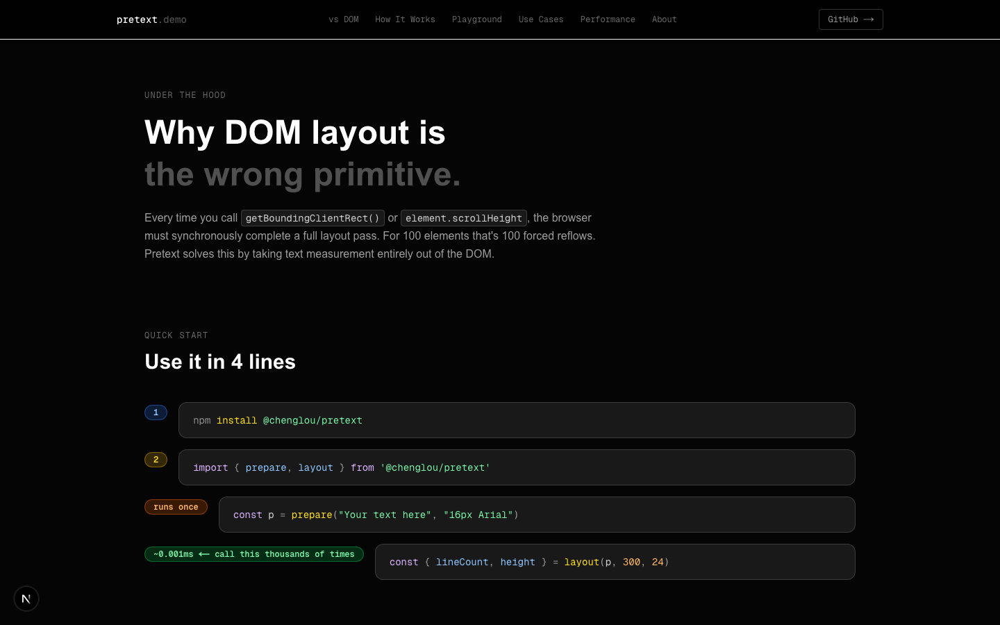
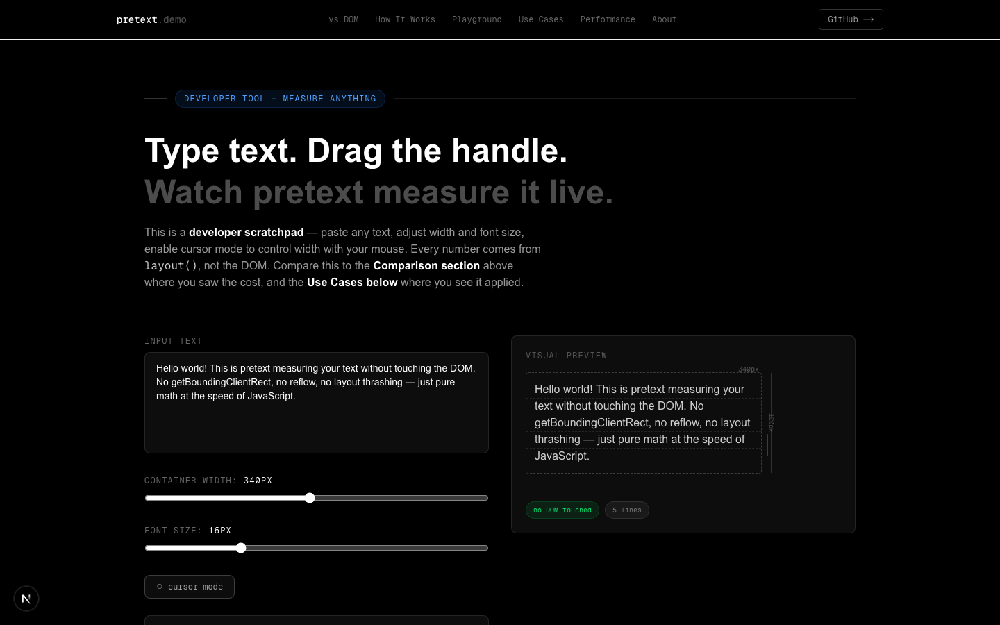
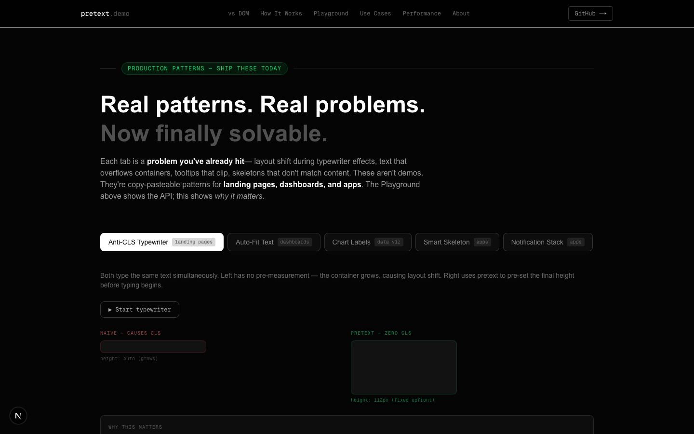
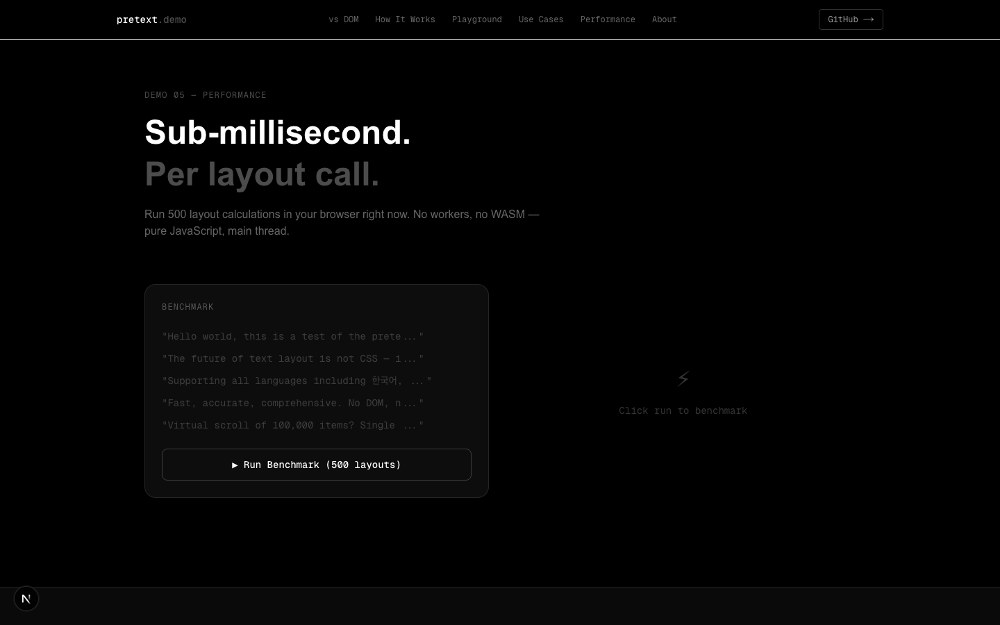

# pretext-demo

> Interactive showcase for [@chenglou/pretext](https://github.com/chenglou/pretext) — text measurement without DOM reflow.

**Live demo → [gauravprwl14.github.io/pretext-demo](https://gauravprwl14.github.io/pretext-demo/)**

---

## Demo



---

## Preview

| | |
|---|---|
|  |  |
| **Hero** — mouse-interactive live measurement | **vs DOM** — side-by-side reflow cost comparison |
|  |  |
| **How It Works** — two-phase design walkthrough | **Playground** — drag handle, cursor mode, live metrics |
|  |  |
| **Use Cases** — 5 production patterns | **Performance** — sub-millisecond benchmark |

---

## What is pretext?

`@chenglou/pretext` measures text width and line count in pure TypeScript — no `getBoundingClientRect`, no `element.scrollHeight`, no forced reflow. It's **5000× faster** than DOM measurements for lists of items.

```ts
import { prepare, layout } from "@chenglou/pretext";

// Phase 1 — runs once per text+font, ~1ms
const p = prepare("Hello world!", "16px Arial");

// Phase 2 — pure arithmetic, ~0.001ms, call thousands of times
const { lineCount, height } = layout(p, 300, 24); // maxWidth=300, lineHeight=24
```

**Phase 1 (`prepare`)** calls `canvas.measureText()` for each character and caches the pixel widths in an array.

**Phase 2 (`layout`)** walks that array, summing widths left→right. When the running sum exceeds `maxWidth`, it starts a new line. No canvas. No DOM. Just addition.

---

## What's in this demo

| Section | What it shows |
|---------|--------------|
| **Hero** | Mouse-interactive live measurement — move your cursor to see lineCount + height update instantly |
| **vs DOM** | Side-by-side comparison: real DOM reflow (3–15ms blocking) vs pretext (~0.001ms) |
| **Kinetic** | Canvas animations where pretext positions serve as physics home targets — wave, gravity, reflow modes |
| **How It Works** | Two-phase design with animated walkthrough of the prepare/layout algorithm + live code examples |
| **Playground** | Developer scratchpad — type text, drag width handle, enable cursor mode |
| **Use Cases** | 5 production patterns: anti-CLS typewriter, auto-fit text, chart labels, smart skeleton, notification stack |
| **Chat Bubbles** | Pretext-measured bubble heights before render |
| **Masonry** | Virtual scroll with pre-measured row heights |
| **Magazine** | Responsive multi-column layout driven by pretext |
| **Performance** | Benchmark: 500 layouts in your browser, no workers, no WASM |

---

## Running locally

```bash
git clone https://github.com/gauravprwl14/pretext-demo
cd pretext-demo
npm install
npm run dev
```

Open [http://localhost:3000](http://localhost:3000).

---

## Tech stack

- **Next.js 16** (App Router, static export)
- **TypeScript**
- **Tailwind CSS v4**
- **Framer Motion**
- **@chenglou/pretext**

---

## Deploy

This repo auto-deploys to GitHub Pages on every push to `main` via GitHub Actions (`.github/workflows/deploy.yml`).

To enable on your fork:

1. Fork this repo
2. Go to **Settings → Pages → Source → GitHub Actions**
3. Push to `main` — the workflow builds and deploys automatically

---

## License

MIT
